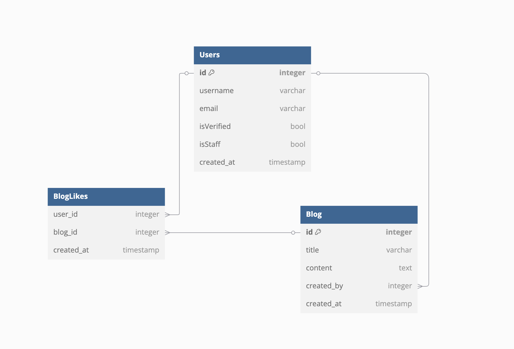

# Blog Application

A Simple Blog Application built with Django Rest Framework and Next.js, with docker support.

## Installation and Setup

### Install Docker

#### Windows & macOS

Download and install Docker Desktop from [Docker Official Webstie](https://docs.docker.com/desktop/) and follow the installation instructions.

#### Linux (Ubuntu/Debian)

Update package list and install Docker:

```
sudo apt update
sudo apt install docker.io docker-compose -y
```

## Verify Installation:

```
docker --version
docker-compose --version
```

Clone the repository to your local machine:

```
git clone https://github.com/sudip-bht/BlogApp-Assessment.git
cd BlogApp-Assessment
```

## Set Environment Variables

Create a `.env` file in the backend directory of the project and add the following variables:

```
EMAIL_HOST_USER=your_gmail_id
EMAIL_HOST_PASSWORD=your_gmail_app_password
```

Replace your_gmail_id and your_gmail_app_password with your actual Gmail credentials for email functionality.

## Docker Setup

### Build and Start Containers

Run the following command to build and start the containers:

```
docker-compose up --build -d
```

This will build and start both the frontend and backend services.

### Verify Running Containers

Check if the containers are running:

```
docker ps
```

You should see two containers running:

django_backend (Backend running on port `8000`)

next_frontend (Frontend running on port `3000`)

### Access the Application

Backend API: http://localhost:8000/

Frontend App: http://localhost:3000/

### Running Commands Inside Containers

If you need to run Django management commands inside the backend container, use:

```
docker exec -it django_backend bash
```

Then, you can run commands like:

```
python manage.py migrate
python manage.py createsuperuser
```

### Stopping and Restarting Containers

To stop the running containers:

```
docker-compose down
```

To restart them:

```
docker-compose up -d
```

Updating the Application

If you make changes to the code, rebuild the containers with:

```
docker-compose up --build -d
```

### Troubleshooting

If you encounter any errors, check the logs:

```
docker-compose logs backend
docker-compose logs frontend
```

This will help diagnose and fix issues quickly.

## Database schema


Here we can see database schema for blog application

#### Many to One

This relation has been implemented so that a single user can be associated with multiple blogs, while each individual blog is linked to just one user

#### Many to Many

Due to time constraints, I wasn't able to implement the many-to-many relationship. However, many-to-many relationships can still be incorporated in the blog application. Features such as blog likes,user follows, comment interactions (with upvotes and downvotes), tags (keywords associated with each blog post), and blog collaborations etc can be implemented. The schema shown above for Blog Likes is one such example because a single blog post can be liked by many users, and each user can like multiple blog posts.
